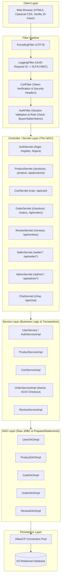

# D4: Architecture Diagram

Architecture layout of **ReshmaMart** showing request lifecycle from client to database.

```mermaid
flowchart TD
    subgraph Client_Layer ["Client Layer"]
        Browser["Web Browser (HTML5, Classical CSS, Vanilla JS Fetch)"]
    end

    subgraph Security_Filter_Pipeline ["Filter Pipeline"]
        F1["EncodingFilter (UTF-8)"]
        F2["LoggingFilter (UUID Request ID -> SLF4J MDC)"]
        F3["CsrfFilter (Token Verification & Security Headers)"]
        F4["AuthFilter (Session Validation & Role Check: Buyer/Seller/Admin)"]
    end

    subgraph Controller_Layer ["Controller / Servlet Layer (Thin MVC)"]
        S_Auth["AuthServlet (/login, /register, /logout)"]
        S_Prod["ProductServlet (/products, /product, /api/products)"]
        S_Cart["CartServlet (/cart, /api/cart)"]
        S_Order["OrderServlet (/checkout, /orders, /api/orders)"]
        S_Review["ReviewServlet (/reviews, /api/reviews)"]
        S_Seller["SellerServlet (/seller/*, /api/seller/*)"]
        S_Admin["AdminServlet (/admin/*, /api/admin/*)"]
        S_Chat["ChatServlet (/chat, /api/chat)"]
    end

    subgraph Service_Layer ["Service Layer (Business Logic & Transactions)"]
        Svc_User["UserService / AuthServiceImpl"]
        Svc_Prod["ProductServiceImpl"]
        Svc_Cart["CartServiceImpl"]
        Svc_Order["OrderServiceImpl (Atomic ACID Checkout)"]
        Svc_Review["ReviewServiceImpl"]
    end

    subgraph DAO_Layer ["DAO Layer (Raw JDBC & PreparedStatements)"]
        DAO_User["UserDAOImpl"]
        DAO_Prod["ProductDAOImpl"]
        DAO_Cart["CartDAOImpl"]
        DAO_Order["OrderDAOImpl"]
        DAO_Review["ReviewDAOImpl"]
    end

    subgraph Persistence_Layer ["Persistence Layer"]
        Pool["HikariCP Connection Pool"]
        DB[("H2 Relational Database")]
    end

    Browser --> F1
    F1 --> F2
    F2 --> F3
    F3 --> F4
    F4 --> Controller_Layer
    Controller_Layer --> Service_Layer
    Service_Layer --> DAO_Layer
    DAO_Layer --> Pool
    Pool --> DB
```
